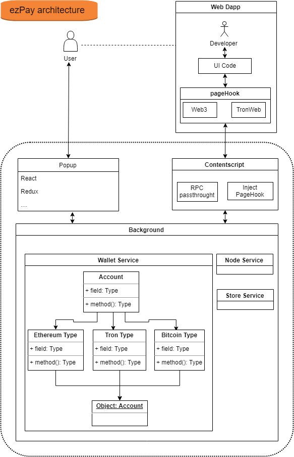

# ezPay

ezPay is a browser wallet for cryptocurrencies. Developers can integrate ezPay into their website to create Decentralised Apps.

## Downloads

## Installation

#### Install yarn
**https://yarnpkg.com/en/docs/install**

#### Install dependencies
```sh
$ yarn install
$ lerna bootstrap
```

## Building
```sh
# Build all sources
$ yarn build
```

```sh
# Build the backend, along with the injected page script
$ yarn build:core
```

```sh
# Build only the popup component
$ yarn build:popup
```

## Linting
```sh
# Run linter over the ./packages folder
$ yarn lint
```

## Links
+ [Website](https://nexty.io/)

## Architecture


